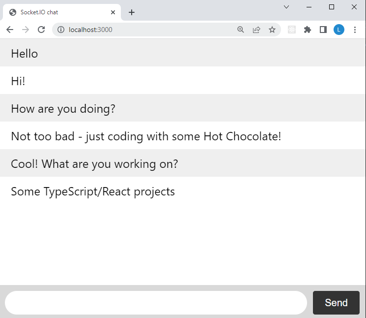
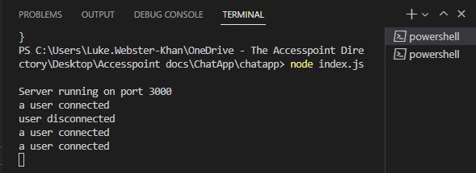

# Chatapp

This is a chat application created with Node.JS and Socket.IO

This app will use localhost:3000 to create a chat example as seen below:

The Server also watches for connections and lists them within the terminal so you know when someone joins/leaves:

